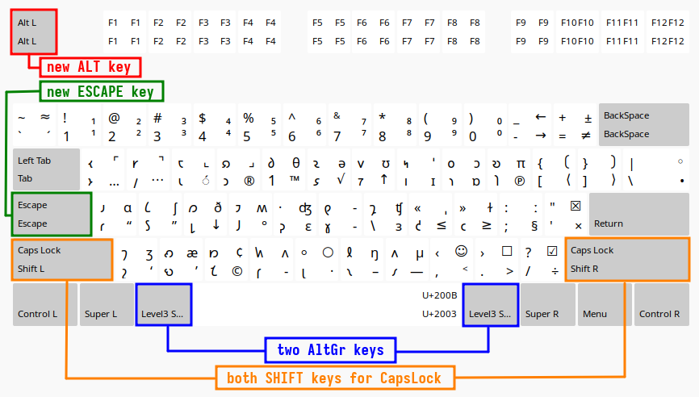

# Keyboard layouts for Linux

## Layouts

 * [English (Phonemic)](docs/Phonemic.md)
 * [English (Phonemic2)](docs/Phonemic2.md)
 * [Shavian (Imperial)](docs/ShawImp.md)
 * [Shavian (QWERTY)](docs/ShawQ.md)
 * [Shavian+ (QWERTY)](docs/ShawPlus.md)
 * [Writer (QWERTY)](docs/Writer.md)
 * [Writer+ (QWERTY)](docs/WriterPlus.md)
 * [Writer+ (ASERTH)](docs/WriterASERT.md)

Please note, that except for the **Shavian (QWERTY)** all other **Linux keyboard layouts** in this project are using the following remapping scheme to improve ergonomics of typing extended (Group2) symbols:

1. **⟮LAlt⟯ = ⟮RAlt⟯** — the **⟮LAlt⟯** key produces the same effect as the **⟮RAlt⟯** key — this improves ergonomics and speed of typing symbols from the AltGR and AltGr+Shift (Group2) levels.
2. **⟮Esc⟯ → LAlt** — the **LAlt** function is mapped to the **⟮Escape⟯** key
3. **⟮CapsLock⟯ → Escape** — the **Escape** function is mapped to the **⟮CapsLock⟯** key
4. **⟮LShift⟯+⟮RShift⟯ → CapsLock** — since many people (Oracle database designers, Bash script developers, etc) may still need the **CapsLock** functionality, it is still available by pressing both **⟮Shift⟯** keys at the same time. To exit capitalization press any of the **⟮Shift⟯** keys or the **⟮CapsLock⟯** key (now being an **ESC** key). Note that on many keyboards pressing both **⟮Shift⟯** keys still turns the CapsLock LED on.




If you don't like this remapping scheme, please edit the symbols file and delete the following section:
```
    replace key <CAPS> {
        type = "ALPHABETIC", symbols = [ Escape, Escape ],
        actions [Group1] = [ SetMods(modifiers=none), SetMods(modifiers=Lock,clearLocks) ]    };
    replace key <ESC> { [ Alt_L, Alt_L ] };
    include "shift(both_capslock_cancel)"
    include "level3(alt_switch)"
```

-----

## Installation

Currently there is no installation script — you have to perform a manual installation.

**Note 1**: Do not edit any files in `/usr/share/X11/xkb` — there is no need for that. Most Linux distros with X11 or Wayland (_libxkbcommon_) allow users to define their custom keyboard layouts. The XKB is scanning for custom  layouts in the following locations:  

 * `$XDG_CONFIG_HOME/xkb/` if `$XDG_CONFIG_HOME` environment variable **is** defined  
 * `$HOME/.config/xkb/` if `$XDG_CONFIG_HOME` environment variable **is not** defined  
 * `$HOME/.xkb/`  
 * `$XKB_CONFIG_EXTRA_PATH` if set, otherwise `<sysconfdir>/xkb` (on most distributions this is `/etc/xkb`)  
 * `$XKB_CONFIG_ROOT` if set, otherwise `<datadir>/X11/xkb/` (path defined by the `xkeyboard-config` package, on most distributions this is `/usr/share/X11/xkb`)  

**Note 2**: in some Linux distros XKB is running with elevated privileges, and although it scans custom directories for the `evdev` and `evdev.xml` layout definitions, it may ignore the custom `symbols` directory (e.g. `$HOME/.config/xkb/symbols` or `/etc/xkb`).  

If your distro does that, you will have to place the custom symbols/layout files in `/usr/share/X11/xkb/symbols` instead of (local) `$HOME/.config/xkb/symbols` or (global) `/etc/xkb/symbols`.  

As long as the file names are different from the default ones, your custom symbols files should not be overwritten during the next system update.

### Current user (local)

1. Download files from this repository:
    * layout file(s) of your choice (for example `Linux/symbols/writerp` for **Writer+ (QWERTY)**)
    * rules files (`Linux/rules/evdev` and `Linux/rules/evdev.xml`)
    * (optional) for **English (Phonemic)** layout (`Linux/XCompose`)
2. Create a local directory — only one of these, the choices is yours:
    * `mkdir $HOME/.config/xkb`
    * `mkdir $HOME/.xkb`
3. Create subdirectories in `xkb` created in step 2, for example:
    * `mkdir $HOME/.config/xkb/rules`
    * `mkdir $HOME/.config/xkb/symbols`
4. Copy the layout file of your choice to the `symbols` folder
5. Copy the `evdev` and `evdev.xml` files to the `rules` folder
    * edit the `evdev.xml` file
    * delete the `<layout>...</layout>` sections for layouts you don't need
6. (Optional) If you want to try out the English (Phonemic) layout you will need the XCompose file
    * `cp XCompose $HOME/.XCompose` — if you don't have an `.XCompose` file
    * `cat XCompose >>$HOME/.XCompose` — if you already have an `.XCompose` file
7. Depending on your distro:
    * open "Control Center" or "Gnome Control Center"
    * go to "Keyboards"
    * under "Input sources" select "Add" or "+" 
    * select "English (United States)"
    * you should be able to select any layout that you left in the `rules/evdev.xml` file (even if you don't have the corresponding file in the `symbols` folder).
8. Test the layout (you may need to activate the WIN+Space layout switch shortcut):
    * if the layout doesn't work, then see **Note 2** above (you may need to copy symbols files to `/usr/share/X11/xkb/symbols`)

### System-wide (global)

1. Download files from this repository:
    * `evdev` and `evdev.xml` from `Linux/rules/` folder
    * layout file(s) of your choice from `Linux/symbols` folder
2. Create system-wide `xkb` folder and sub-directories:
    * `sudo mkdir /etc/xkb`
    * `sudo mkdir /etc/xkb/rules`
    * `sudo mkdir /etc/xkb/symbols`
3. Copy files:
    * `evdev` and `evdev.xml` to `/etc/xkb/rules`
    * layout files to `/etc/xkb/symbols`
4. Edit `evdev.xml` file and delete the `<layout>...</layout>` sections for unwanted layouts.
5. (Optional) copy the `XCompose` file to `/etc/xkb` and for users who may want to use this layout create links in their home directories `$HOME/.XCompose` to that file. For example:
    * `ln -s /etc/xkb/XCompose /home/johndoe/.XCompose`
6. Test the layout, if it is discovered by the XKB but still does not work, then see **Note 2** (you may have to put the symbols files in `/usr/share/X11/xkb/symbols`).


### On-Screen Keyboards

When learning a new keyboard layout (Colemak, ASERT, Shavian) it may be helpful to use an On-Screen Keyboard.
Most (if not all) Linux distros provide at least one option. Usually you can activate it in `Settings > Accessibility > Typing > Screen keyboard`.

* [Ubuntu](https://help.ubuntu.com/stable/ubuntu-help/keyboard-osk.html.en)  
* [Gnome](https://help.gnome.org/users/gnome-help/stable/keyboard-osk.html.en)
* [KDE Virtual Keyboard](https://store.kde.org/p/1132203/)
* [Maliit](https://maliit.github.io/)
* [Onboard](https://launchpad.net/onboard).

At least one of these should be available for your distro.  
Search your software repository for keywords: “onboard”, “maliit”, “kvkbd”, or simply “keyboard”. 


-----
Copyright (c) 2024 Neil Raiden (AGPL v3)
