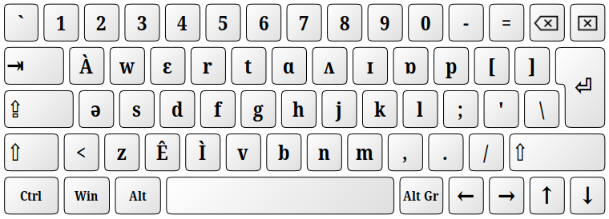
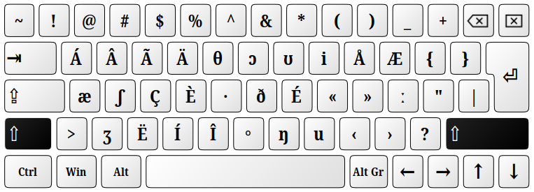
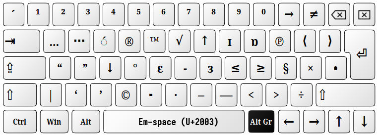
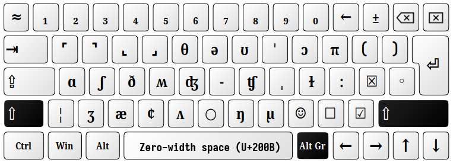

# Keyboard layout: English (Phonemic2)

This keyboard layout identical to "English (Phonemic).

The only difference is that it is using a slightly different way of converting keystrokes into phoneme strings.  
The XCompose file on some Linux distros does not convert 2-byte Unicode points (like U+FDD0).  
This layout produces code points from range U+00C0-00CE (as opposed to U+FDD0-FDDE) and because of that requires a different `.XCompose` file.  

Please note, that if the `~/.XCompose` file is missing, you will see the following symbols from the 00C0-00CE range instead of multi-phoneme strings like “ɔɪ”, “aʊ”, etc:

**À Á Â Ã Ä Å Æ Ç È É Ê Ë Ì Í**


### XCompose

Add the following section to your `$HOME/.XCompose` file:

```
<U00C0> : "ɔɪ"
<U00C1> : "aʊ"
<U00C2> : "ɪə"
<U00C3> : "eɪ"
<U00C4> : "ɑːr"
<U00C5> : "əʊ"
<U00C6> : "ɔːr"
<U00C7> : "ər"
<U00C8> : "aɪ"
<U00C9> : "dʒ"
<U00CA> : "ɜːr"
<U00CB> : "ɛər"
<U00CC> : "tʃ"
<U00CD> : "ɪər"
<U00CE> : "ju"
```


### Unshifted:



### Shifted:



### AltGr (RightAlt or LeftAlt+Ctrl):



### AltGr+Shift (RightAlt+Shift or LeftAlt+Ctrl+Shift):




-----
Copyright (c) 2024 Neil Raiden (AGPL v3)