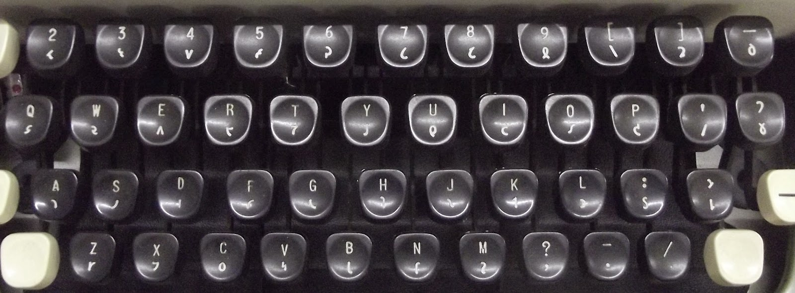
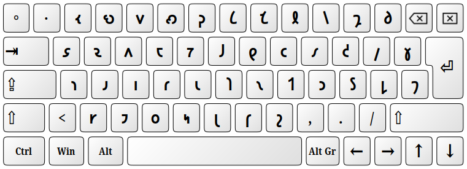
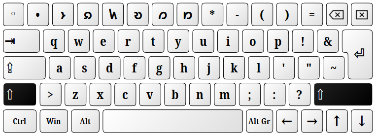
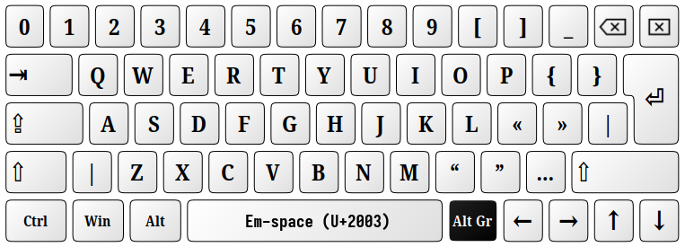

# Keyboard Layout: Shavian (Imperial)

This keyboard layout is based on __Imperial Good Companion Model 6__ typewriter.

Please note: This keyboard layout **is not based** on the [Keyman Shaw Imperial](https://keyman.com/keyboards/english_shavian_igc).

Notes on the __Imperial Model 6__ typewriter:

* it had no keys ⟮`⟯ and ⟮1⟯
* it had no digits 0 and 1. Just like on many very old typewriters I and O was used instead
* it had only capital Latin letters available after using **CapsLock** lever
* it had no CapsLock button — just like many old typewriters it had a lever to lock the SHIFT key (actually to lock the roller pin in the upper position).
* the keys ⟮3⟯ and ⟮5⟯ had Shavian letters (IPA equivalents: ⟨ɛ⟩ and ⟨e⟩) which are not in official Shavian Unicode charset. Currently the only font supporting those extra Shavian letters is only Inter Alia. So instead, the following symbols are linked ⟨𐑻⟩ and ⟨𐑺⟩ to those keys.
* it had no letters ⟨𐑸,𐑹,𐑿,𐑼,𐑽⟩.
* it had no exclamation point ⟨!⟩, no double-quote mark ⟨"⟩, no semi-colon ⟨;⟩
* punctuation marks on the SHIFT line were: unshifted ⟨,·.⟩; shifted ⟨?-/⟩

Possibly the lack of Shavian letters and missing punctuation marks mentioned above were among the reasons why Shavian wasn't adopted back in 1970‐ties. That and, off course, the price of the _Imperial Model 6_ being about five times higher than a regular typewriter.

Differences between this keyboard layout and the original _Imperial Model 6_ :

* lowercase Latin letters in the **shifted** layer instead of uppercase
* missing Shavian letters ⟨𐑸,𐑹,𐑿,𐑼,𐑽⟩ added to the **shifted** layer in the numerals line 
* this layout adds symbols to keys ⟮`⟯ and ⟮1⟯:
    - ⟨⸰⟩ and ⟨·⟩ (namer dot) in **Unshifted** layer
	- ⟨◦⟩ and ⟨•⟩ (bullets) in **Shifted** layer
	- numbers ⟨0⟩ and ⟨1⟩ in AltGR layer.
* uppercase Latin letters in **AltGr** layer
* punctuation marks on the SHIFT line (unshifted layer) are ⟨,./⟩ instead of originally ⟨,·.⟩
* punctuation marks on the SHIFT line (shifted layer) are ⟨?;!⟩ instead of ⟨?-/⟩
* tilde and double-quote mark added to the ⟮\|⟯ key
* also, some of the most common punctuation marks were added to the **AltGR+Shift** layer (see tables below).

Note: *In Windows AltGr(Right Alt) is equivalent to Alt+Ctrl.*


### Unshifted
```
┌───┬───┬───┬───┬───┬───┬───┬───┬───┬───┬───┬───┬───┬──────┐
│ ⸰ │ · │ 𐑬 │ 𐑻 │ 𐑫 │ 𐑺 │ 𐑜 │ 𐑖 │ 𐑗 │ 𐑙 │ 𐑘 │ 𐑡 │ 𐑔 │ bksp │
├───┴─┬─┴─┬─┴─┬─┴─┬─┴─┬─┴─┬─┴─┬─┴─┬─┴─┬─┴─┬─┴─┬─┴─┬─┴─┬────┤
│ tab │ 𐑭 │ 𐑷 │ 𐑵 │ 𐑱 │ 𐑳 │ 𐑓 │ 𐑞 │ 𐑤 │ 𐑥 │ 𐑒 │ 𐑢 │ 𐑣 │ 𐑠  │
├─────┴─┬─┴─┬─┴─┬─┴─┬─┴─┬─┴─┬─┴─┬─┴─┬─┴─┬─┴─┬─┴─┬─┴─┬─┴────┤
│ caps  │ 𐑪 │ 𐑨 │ 𐑦 │ 𐑩 │ 𐑧 │ 𐑐 │ 𐑯 │ 𐑑 │ 𐑮 │ 𐑕 │ 𐑛 │  ent │
├───────┴─┬─┴─┬─┴─┬─┴─┬─┴─┬─┴─┬─┴─┬─┴─┬─┴─┬─┴─┬─┴─┬─┴──────┤
│ shift   │ 𐑾 │ 𐑲 │ 𐑴 │ 𐑰 │ 𐑚 │ 𐑝 │ 𐑟 │ , │ . │ / │  shift │
└─────────┴───┴───┴───┴───┴───┴───┴───┴───┴───┴───┴────────┘
```

### Shifted
```
┌───┬───┬───┬───┬───┬───┬───┬───┬───┬───┬───┬───┬───┬──────┐
│ ◦ │ • │ 𐑼 │ 𐑸 │ 𐑿 │ 𐑹 │ 𐑼 │ 𐑽 │ * │ - │ ( │ ) │ = │ bksp │
├───┴─┬─┴─┬─┴─┬─┴─┬─┴─┬─┴─┬─┴─┬─┴─┬─┴─┬─┴─┬─┴─┬─┴─┬─┴─┬────┤
│ tab │ q │ w │ e │ r │ t │ y │ u │ i │ o │ p │ ! │ & │ ~  │
├─────┴─┬─┴─┬─┴─┬─┴─┬─┴─┬─┴─┬─┴─┬─┴─┬─┴─┬─┴─┬─┴─┬─┴─┬─┴────┤
│ caps  │ a │ s │ d │ f │ g │ h │ j │ k │ l │ ' │ " │  ent │
├───────┴─┬─┴─┬─┴─┬─┴─┬─┴─┬─┴─┬─┴─┬─┴─┬─┴─┬─┴─┬─┴─┬─┴──────┤
│ shift   │ z │ x │ c │ v │ b │ n │ m │ ; │ : │ ? │  shift │
└─────────┴───┴───┴───┴───┴───┴───┴───┴───┴───┴───┴────────┘
```

### AltGr (right-Alt key)
```
┌───┬───┬───┬───┬───┬───┬───┬───┬───┬───┬───┬───┬───┬──────┐
│ 0 │ 1 │ 2 │ 3 │ 4 │ 5 │ 6 │ 7 │ 8 │ 9 │ [ │ ] │ _ │ bksp │
├───┴─┬─┴─┬─┴─┬─┴─┬─┴─┬─┴─┬─┴─┬─┴─┬─┴─┬─┴─┬─┴─┬─┴─┬─┴─┬────┤
│ tab │ Q │ W │ E │ R │ T │ Y │ U │ I │ O │ P │ { │ } │  | │
├─────┴─┬─┴─┬─┴─┬─┴─┬─┴─┬─┴─┬─┴─┬─┴─┬─┴─┬─┴─┬─┴─┬─┴─┬─┴────┤
│ caps  │ A │ S │ D │ F │ G │ H │ J │ K │ L │ « │ » │  ent │
├───────┴─┬─┴─┬─┴─┬─┴─┬─┴─┬─┴─┬─┴─┬─┴─┬─┴─┬─┴─┬─┴─┬─┴──────┤
│ shift   │ Z │ X │ C │ V │ B │ N │ M │ “ │ ” │ … │  shift │
└─────────┴───┴───┴───┴───┴───┴───┴───┴───┴───┴───┴────────┘
```

### AltGr+Shift (right Alt key + Shift)
```
┌───┬───┬───┬───┬───┬───┬───┬───┬───┬───┬───┬───┬───┬──────┐
│ ` │ ´ │ @ │ # │ $ │ % │ ^ │ & │ × │ ÷ │ < │ > │ + │ bksp │
├───┴─┬─┴─┬─┴─┬─┴─┬─┴─┬─┴─┬─┴─┬─┴─┬─┴─┬─┴─┬─┴─┬─┴─┬─┴─┬────┤
│ tab │   │   │   │   │   │   │   │   │   │   │   │   │ \  │
├─────┴─┬─┴─┬─┴─┬─┴─┬─┴─┬─┴─┬─┴─┬─┴─┬─┴─┬─┴─┬─┴─┬─┴─┬─┴────┤
│ caps  │   │   │   │   │   │   │   │   │   │ ‹ │ › │  ent │
├───────┴─┬─┴─┬─┴─┬─┴─┬─┴─┬─┴─┬─┴─┬─┴─┬─┴─┬─┴─┬─┴─┬─┴──────┤
│ shift   │   │   │   │ ⁃ │ ○ │ – │ — │ ‘ │ ’ │   │  shift │
└─────────┴───┴───┴───┴───┴───┴───┴───┴───┴───┴───┴────────┘
```
-----

The keyboard of **Imperial Good Companion Model 6** typewriter:



-----

### Unshifted



### Shifted



### AltGr



### AltGr + Shift


-----
Copyright (c) 2024 Neil Raiden (AGPL v3)