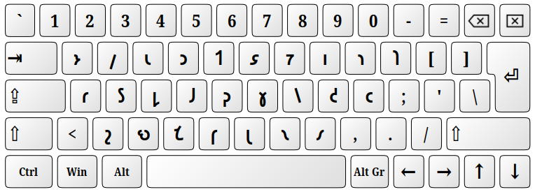
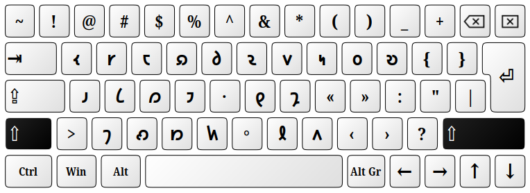

# Shavian (QWERTY)

This is the simple 2-level (unshifted and shifted) keyboard layout for writing in Shavian Alphabet (Unicode range U+10450-U+1047f).

It is identical to the [Shaw QWERTY](https://keymanweb.com/#en-shaw,Keyboard_english_shavian_qwerty) layout on the [Keyman.com](https://keyman.com) website made by **Ed Greville** under the MIT license.

>The origins of this layout can be traced back to the old‐style Shavian fonts from pre-Unicode era and which predate Keyman Shaw QWERTY by about 3 decades. Probably the first such font was the famous _Lionspaw_ by Lionel Ghoti, from around 1995-2000. So it can be said that the actual inventor of this layout is _Lionel Ghoti_. 

>The differences: those old Shavian fonts were using forward slash ⟨/⟩ as a namer dot (instead of capital "G"). And instead of guillemets we had black squares. The custom was to use these black squares as a sort‐of CapsLock indicator — enclosing the capitalized text. The namer dot was used mostly for single words starting with a capital letter.

### Unshifted:

### Shifted:

-----
Copyright (c) 2024 Neil Raiden