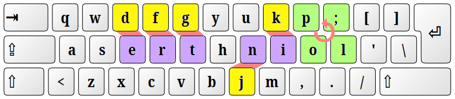

# Writer+ (ASERTH)

>Note: **ASERTH\*** in tables below is the **QWERTY-flip-twist** by Nick Gravgaard project ([GitHub](https://github.com/nick-gravgaard/qwerty-flip)) to which the **Writer+ (ASERTH)** layout only adds extra symbols to AltGr layers.

### Letter statistics

The most common 'symbol' in all English text is off course the symbol of 'space' — about 20% of all text — that's why it is the largest key on every keyboard.

Excluding space, only the **top ten** letters [ETAOINSRHL](https://norvig.com/mayzner.html) make almost 75% of all text[¹](https://norvig.com/mayzner.html).

| No. | letter | percent | % of total | QWERTY home | ASERT home | Dvorak home | Colemak home | ASERTH\* home |
|:---:|:------:|:-------:|:----------:|:-----------:|:----------:|:-----------:|:------------:|:-------------:|
|  1  | E | 12.49% | 12.49% |  -  | yes | yes | yes | yes |
|  2  | T |  9.28% | 21.77% |  -  | yes | yes | yes | yes |
|  3  | A |  8.04% | 29.81% | yes | yes | yes | yes | yes |
|  4  | O |  7.64% | 37.45% |  -  | yes | yes | yes | yes |
|  5  | I |  7.57% | 45.02% |  -  | yes | yes | yes | yes |
|  6  | N |  7.23% | 52.25% |  -  | yes | yes | yes | yes |
|  7  | S |  6.51% | 58.76% | yes | yes | yes | yes | yes |
|  8  | R |  6.28% | 65.04% |  -  | yes |  -  | yes | yes |
|  9  | H |  5.05% | 70.09% | yes | yes | yes | yes | yes |
| 10  | L |  4.07% | 74.16% | yes |  -  |  -  |  -  | yes |

There are 11 keys on the home row of the QWERTY layout (ASDFGHJKL;'), of which only 4 are the most common letters.  

>Note:  
>Bringing the top 10 common letters to the home row would result in highest gains in reducing finger fatigue and improving typing speed.  
>Strangely, there is no "L" on the home row of the famous Colemak layout.

### Bi-gram statistics

There are 26×26=676 possible two-letter sequences (bigrams).

The top 10 most common bi-grams (1.40% of 676) make over 20% of all English text.
The top 50 most common bi-grams (7.39% of 676) make over 55% of all English text.
>Note: statistics based on article <https://norvig.com/mayzner.html>.

| top | % of 676 | % of English |
|:---:|:--------:|:------------:|
|  10 |    1.48% |     21.0%    |
|  50 |    7.40% |     55.6%    |
| 100 |   14.79% |     76.0%    |
| 150 |   22.19% |     87.3%    |

The table below shows how many letters of the most common bigrams are on the home row of the most popular keyboard layouts:

| No. |  bigram | PERCENT | Percent of total | QWERTY home row | ASERT home row | Dvorak home row | Colemak home row | ASERTH* |
|:---:|:-------:|:-------:|:--------:|:---:|:---:|:---:|:---:|:---:|
|  1  |    TH   | 3.56%   |   3.56%  |  1  |  2  |  2  |  2  |  2  |
|  2  |    HE   | 3.07%   |   6.63%  |  1  |  2  |  2  |  2  |  2  |
|  3  |    IN   | 2.43%   |   9.06%  |  0  |  2  |  2  |  2  |  2  |
|  4  |    ER   | 2.05%   |  11.11%  |  0  |  2  |  1  |  2  |  2  |
|  5  |    AN   | 1.99%   |  13.10%  |  1  |  2  |  2  |  2  |  2  |
|  6  |    RE   | 1.85%   |  14.95%  |  0  |  2  |  1  |  2  |  2  |
|  7  |    ON   | 1.76%   |  16.71%  |  0  |  2  |  2  |  2  |  2  |
|  8  |    AT   | 1.49%   |  18.20%  |  1  |  2  |  2  |  2  |  2  |
|  9  |    EN   | 1.45%   |  19.65%  |  0  |  2  |  2  |  2  |  2  |
| 10  |    ND   | 1.35%   |  21.00%  |  1  |  1  |  2  |  2  |  1  |

>Note:  
>Only 5 letters (out of 20) for top 10 bi-grams are on QWERTY home row — this is highly inefficient!

Bi-gram letters on home row by layout type:

| Keyboard |  Home Row  | Top 10 bigrams | Top 50 bigrams | Top 100 bigrams |
|:---------|:----------:|:--------------:|:--------------:|:--------------:|
| QWERTY   | ASDFGHJKL; |  5 | 30 |  61 |
| Dvorak   | AOEUIDHTNS | 18 | 76 | 144 |
| ASERT    | ASERTHNIOP | 19 | 79 | 149 |
| Colemak  | ARSTDHNEIO | 20 | 82 | 150 |
| ASERTH*  | ASERTHNIOL | 19 | 84 | 157 |

Colemak layout home row has the best coverage for top 10 bigrams, thanks to letter "D" on the home row — but not for 50 bigrams.  

### Conclusion

The major differences between Colemak and ASERTH (QWERTY-flip-twist) layouts are:

| differences| Colemak | ASERTH |
|:-----------|:-------:|:------:|
| home row   |     D   |    L   |
| rearranged keys | 17 | 14 |
| keys in the same positions as QWERTY | 10 | 13 |

While Colemak is the result of very detailed analysis of letter frequencies and distances fingers have to travel between keys, it is actually hard to learn.
Although not as hard as Dvorak. 

For someone learning the layout from the beginning it may not be an issue, but it is an issue for people already proficient with QWERTY (over 50 wpm). 

So the best layout may be the one retaining as many keys from QWERTY while providing most of the same benefits as Colemak.

Out of the group of Colemak, ASERT and ASERTH (QWERTY-flip) the simplest option seems to be ASERTH. The rearrangement scheme is much easier to remember than for  Colemak:

 * flip keys ⟮ERT⟯ with ⟮DFG⟯
 * flip ⟮N⟯ with ⟮J⟯
 * flip ⟮K⟯ with ⟮I⟯
 * twist or rotate (counter-clockwise): ⟮L⟯ → ⟮;⟯ → ⟮P⟯ → ⟮O⟯ → ⟮L⟯

Keyboard layouts in Linux (unlike Windows) are simple text files that you can modify to your liking.
If you don't feel comfortable switching to the new layout, you can modify the keys gradually.
For example, swap ⟮E⟯ with ⟮D⟯ then train for a week before swapping ⟮R⟯ with ⟮F⟯. Only the rotation of the ⟮L;PO⟯ keys needs to be done all at once.

Have fun. ☺

-----
Copyright (c) 2024 Neil Raiden AGPL v3
