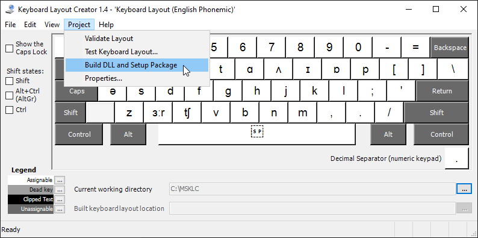

# Keyboard Layouts

What problems does this project aim to solve?

## 1. Keyboard Layout (Writer) — for writers, authors, editors, publishers.

### Problem

All the novels, essays, newspaper articles, etc — anything that is published — must follow specific rules outlined in the writing guides such as the famous “Chicago Manual of Style”.

For example writing guides require writers, authors, publishers to use:
 · 66-99 quotation marks and 6-9 marks for quotations inside quotations
 · En-dash, Em-dash, several types of hyphens — not the hyphen-minus
 · ellipsis, footnotes, endnotes, etc.

None of those symbols is available on the standard English QWERTY keyboard layout. Neither on Dvorak and Colemak.

Instead, writers must either:
 • memorize a list of Alt codes
 • laboriously copy the symbols from the CharacterMap or a similar app
 • or use an expensive software dedicated for writers that auto-magically replaces typed symbols with the correct ones.

Unfortunately "smart quotes" are not implemented in every text editor — **that is THE PROBLEM**.

### Solution
This keyboard layout allows you to type those most commonly used symbols with **AltGr** (right Alt key) and **AltGr+Shift** in a way easier to memorize than soul‑less numbers.

Now you can write your novel even in Notepad.

[Keyboard Layout (Writer) for Windows](Windows/Writer/README.md)

## Keyboard layout (English Writer+)

Occasionally some English teachers may need to write English IPA phonemes. 

\/ðɪs sɪmpəl kibɔrd leɪaʊt meɪ hɛlp ðəm tə duː dʒʌst ðæt\/

[Keyboard Layout (Writer+) for Windows](Windows/Writer+/README.md)

-----

## Keyboard layout (English Phonemic) - for learners of spoken English.

### Problem
The whole range of English phonemes used in most English dictionaries is already supported by Unicode.
Moreover, some symbols are “obsoleted” and new ones recommended in their place.
English IPA phonemes are spread all over the several Unicode charsets. Only _thorn_ ⟨θ⟩ is from Greek charsets, all other IPA symbols are located in various Latin _supplement_ and _extension_ charsets.

So if you use the _CharacterMap_ to find those symbols, unknowingly you may be using similar, but the wrong ones.

There seem to be no keyboard layout that would let you enter those codes to write in fully phonemic English — and **that is THE PROBLEM**.
Although it may seem to be a borderline problem, **it is not**.

The best learning tool invented by humans is **writing**. 
Reading, listening — these only help you to acquire knowledge, **memorize**.
Writing (especially in your own words) helps you to **apply** your knowledge, and the first step of applying is to **recall** from memory.

Two processes of learning a language (like English):
1. Spoken
 • **listen** a lot (memorize — build audio vocabulary)
 • **speak** or read aloud (recall and apply)
2. Written
 • **read** a lot (memorize writing — build written vocabulary)
 • **write** a lot (recall and apply)
 
Because of huge discrepancy between _written_ and _spoken_ English, many people build different size audio and visual vocabularies in their heads. Because of that many people, especially non‑native speakers and some dyslectics, are unable to fully express their thoughts, but instead are using the most common basic words. 

Learning and practicing (even only occasionally) a phonetic or phonemic writing may help build a bridge between the _written_ and _spoken_ English.

### Solution

The English Phonemic keyboard layout may help you with that.
[Keyboard Layout (Phonemic) for Windows](Windows/Phonemic/README.md)

-----

## Keyboard layouts for Shavian alphabet.

### Problem
If you've already tried the **English Phonemic** keyboard layout, you might have noticed that a lot of English phonemes take 2 or even 3 IPA symbols. What a waste of space. That's where the Doom music—, əhɛm, that's where the **Shavian Alphabet** kicks in.

All English phonemes are represented by a single letter.
That feature of the Shavian Alphabet makes English **fully phonemic**.

**The learning curve of Shavian Alphabet is definitely much steeper, but the benefits may outweigh that.**

1. The Shavian Alphabet was designed for **fast** writing, all letters are **single‐stroke** symbols.
> In this aspect it is also the **simplest shorthand system**, unlike Gregg or Pitmann. Please note here that neither Gregg nor Pitmann characters are implemented in Unicode. And there are no fonts to display them either. 
> The single‑stroke feature may result in about 20% increase in writing speed. 

2. English written with Shavian Alphabet takes about 20% less space.
> This feature can give you another 20% boost in writing speed.

There are already solutions for writing in Shavian Alphabet — most notable one is [Keyman](https://www.keyman.com).
However, Keyman on Windows takes over 200MB of space, and sometimes acts very strangely. For example, it switches keyboard layouts intermittently without any warning. This makes it a bit irritating and quite unusable.
There is also a number of websites with kind of on‐screen keyboards, that allow you to write in Shavian, then copy the text and paste where you actually need it. It's only a partial solution, and is cumbersome.

Practically there is no other solution — and that is **THE PROBLEM** this project aims to solve.

### Solution
The perfect solution is a keyboard layout designed **specifically for your operating system**.

* [Keyboard Layout (Shavian QWERTY) for Windows](Windows/ShavianQWERTY/README.md)
* [Keyboard Layout (Shavian QWERTY+) for Windows](Windows/ShavianQWERTY+/README.md)

-----

## How to compile .klc for Windows

1. Download the `.klc` file of your choice from this repository
2. Download MSKLC v1.4 (Microsoft Keyboard Layout Creator version 1.4) from Microsoft website:
    - [Description & download](https://www.microsoft.com/en-us/download/details.aspx?id=102134)
    - [Direct link to binaries](https://download.microsoft.com/download/6/f/5/6f5ce43a-e892-4fd1-b9a6-1a0cbb64e6e2/MSKLC.exe>)
3. Install MSKLC on your PC
4. Open the `.klc` file in MSKLC
5. Build binaries `Project › Build DLL and Setup Package`
6. When ready open the binaries folder and tun `setup.exe` to install.

-----

## After installation

1. Open Windows Setup (WinKey + I)
2. Go to `Time & Language`
3. Select `Language`
4. At the bottom of the screen click on `English (United States) — the `Options` button will appear: click on it
5. At the bottom you should see a list of keyboard layouts
    - if there is only `US QWERTY`, then click `Add a keyboard` and install additional layout
6. Go back to `Settings › Language`
7. Click on `Keyboard`
    - you may select your favorite layout as a default keyboard
	- you may set a different input method for each app window
8. Click on `Language bar options`
    - recommended: on `Language Bar` tab select `Docked in the taskbar`
9. On `Advanced Key Settings` you may:
    - set up a hotkey for switching languages/layouts (default is `Left Alt+Shift`
	- assign hotkeys to switch directly to your favorite layout
	- remember: if you leave it unchanged the default switch to `English (United States) QWERTY` is **Ctr+1**
	- remember: second default hotkey for switching languages/layouts (aka “input methods”) is **WinKey+Space**
10. You may need to reboot Windows to see the Language Bar next to the system clock icon — in this respect Windows is waaaaaaay behind Linux.

## On-Screen Keyboards (OSK)

Windows provides two On‑Screen Keyboards:
 * Old OSK.exe (`c:\Windows\System32\osk.exe`) — to start use `WinKey+Ctrl+O`
 * New TabTip.exe (`c:\Program Files\Common Files\microsoft shared\ink\TabTip.exe`) - TabTip stands for TABlet Text Input Panel — part of Inking (WinKey+I › Devices › Pen & Windows Ink)

To start either one:
 * osk.exe — `WinKey+Ctrl+o`
 * tabtip.exe — right‑click system clock, select `Show touch keyboard button`. Click the keyboard button.

Please note: **NONE of these two fully supports Unicode.** Again, Windows is waaaaay behind Linux.
The only layout that semi‑works with OSK.exe is the **English Phonemic** — but only in the **Unshifted** and **Shifted** layers.

-----
