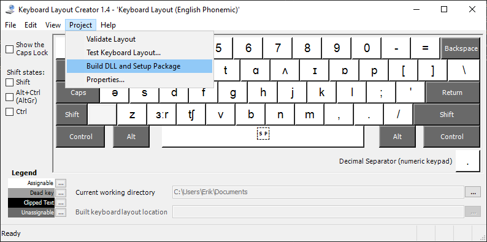

## How to compile .klc files

1. Download the `.klc` file of your choice from this repository
2. Download MSKLC v1.4 (Microsoft Keyboard Layout Creator version 1.4) from Microsoft website:
    - [Description & download](https://www.microsoft.com/en-us/download/details.aspx?id=102134)
    - [Direct link to binaries](https://download.microsoft.com/download/6/f/5/6f5ce43a-e892-4fd1-b9a6-1a0cbb64e6e2/MSKLC.exe>)
3. Install MSKLC on your PC
4. Open the `.klc` file in MSKLC
5. Build binaries `Project › Build DLL and Setup Package`

-----

## Installation and configuration

When compilation of the KLC file is complete, simply open the binaries folder and run `setup.exe` to install.

### Configuration steps:

1. Open Windows Setup (WinKey + I)
2. Go to `Time & Language`
3. Select `Language`
4. At the bottom of the screen click on `English (United States)` — the `Options` button will appear, click it
5. At the bottom you should see a list of keyboard layouts
    - if there is only `US QWERTY`, then click `Add a keyboard` and install additional layout
6. Go back to `Settings › Language`
7. Click on `Keyboard`
    - you may select your favorite layout as a default keyboard
	- you may set a different input method for each app window
8. Click on `Language bar options`
    - recommended: on `Language Bar` tab select `Docked in the taskbar`
9. On `Advanced Key Settings` you may:
    - set up a hotkey for switching languages/layouts (default is `Left Alt+Shift`
	- assign hotkeys to switch directly to your favorite layout
	- remember: if you leave it unchanged the default switch to `English (United States) QWERTY` is **Ctr+1**
	- remember: second default hotkey for switching languages/layouts (aka “input methods”) is **WinKey+Space**
10. You may need to reboot Windows to see the Language Bar next to the system clock icon — in this respect Windows is waaaaaaay behind Linux.

-----

## On-Screen Keyboards (OSK)

Windows provides two On‑Screen Keyboards:

 * Old **OSK.exe** (`c:\Windows\System32\osk.exe`) — to start, press `WinKey+Ctrl+O`
 * New **TabTip.exe** (`c:\Program Files\Common Files\microsoft shared\ink\TabTip.exe`) - TabTip stands for **Tab**let **T**ext **I**nput **P**anel — part of the Inking feature (WinKey+I › Devices › Pen & Windows Ink)

To start either one:

 * osk.exe — `WinKey+Ctrl+o`
 * tabtip.exe — right‑click system clock, select `Show touch keyboard button`. Click the keyboard button.

Please note: **NONE of these two fully supports Unicode.** Again, Windows is waaaaay behind Linux.

The only layout from this project that semi‑works with OSK.exe is the **English (Phonemic)** — but only in the *Unshifted* and *Shifted* layers.

-----
Copyright (c) 2024 Neil Raiden (AGPL v3)
