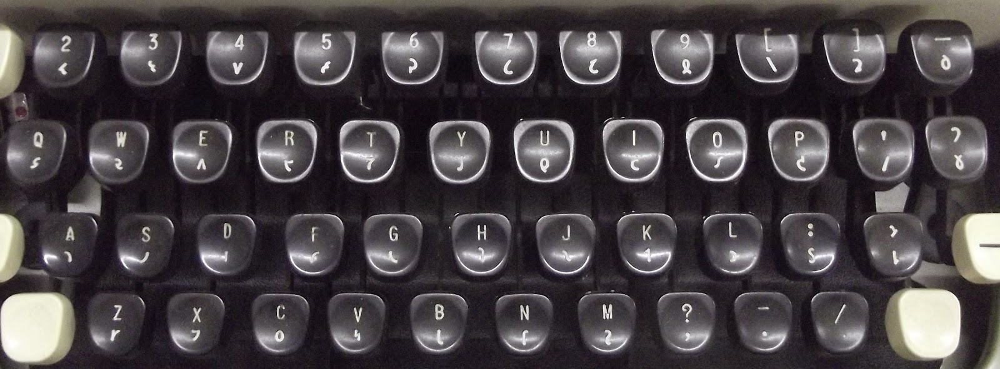

# Keyboard Layout (Shavian Imperial)

**This keyboard layout is based on _Imperial Good Companion Model 6_ typewriter.**

Please note: This keyboard layout **is not based** on the [Keyman Shaw Imperial](https://keyman.com/keyboards/english_shavian_igc).

It is mostly a historical curiosity.

Notes on the _Imperial Model 6_ typewriter:

* it had no keys ⟮`⟯ and ⟮1⟯ — this layout adds symbols ⟨⸰⟩ and ⟨·⟩ to those keys.
* it had no digits 0 and 1. Just like on very old typewriters I and O was used instead — this layout adds 0 and 1 to keys ⟮`⟯ and ⟮1⟯ in AltGR layer.
* it had only capital Latin letters available after pressing Shift (or CapsLock)
* it had no CapsLock button — just like many old typewriters it had a lever to lock the SHIFT key (actually to lock the roller in the upper position).
* the keys ⟮3⟯ and ⟮5⟯ had Shavian letters (IPA equivalents: ⟨ɛ⟩ and ⟨e⟩) which are not in official Shavian Unicode charset instead of ⟨𐑻⟩ and ⟨𐑺⟩. Currently the only font supporting those letters is Inter Alia.
* it had no letters ⟨𐑸,𐑹,𐑿,𐑼,𐑽⟩.
* it had no exclamation point ⟨!⟩, no double-quote mark ⟨"⟩, no semi-colon ⟨;⟩
* punctuation marks on the SHIFT line were: unshifted ⟨,·.⟩; shifted ⟨?-/⟩

Possibly the lack of Shavian letters and missing punctuation marks mentioned above were among the reasons why Shavian wasn't adopted back in 1970‐ties. That and, off course, the price of the _Imperial Model 6_ being about five times higher than a regular typewriter.

Differences between this keyboard layout and the original _Imperial Model 6_:

* lowercase Latin letters in the **shifted** layer instead of capital Latin letters
* missing Shavian letters ⟨𐑸,𐑹,𐑿,𐑼,𐑽⟩ added to the **shifted** layer in the digits line 
* capital Latin letters in **AltGr** layer.
* the “namer dot” symbol moved to key ⟮1⟯, and ⟨⸰⟩ (Shavian capitals) to key ⟮`⟯
* punctuation marks on the SHIFT line (unshifted layer) are ⟨,./⟩ instead of originally ⟨,·.⟩
* punctuation marks on the SHIFT line (shifted layer) are ⟨?;!⟩ instead of ⟨?-/⟩
* tilde and double-quote mark added to the ⟮\|⟯ key
* also, some of the most common punctuation marks were added to the **AltGR+Shift** layer (see tables below).


Note: *In Windows AltGr(Right Alt) is equivalent to Alt+Ctrl.*


Again, this is only a historical curiosity (only slightly modernized).


For more details please see tables below:

### Unshifted

```
┌───┬───┬───┬───┬───┬───┬───┬───┬───┬───┬───┬───┬───┬──────┐
│ ⸰ │ · │ 𐑬 │ 𐑻 │ 𐑫 │ 𐑺 │ 𐑜 │ 𐑖 │ 𐑗 │ 𐑙 │ 𐑘 │ 𐑡 │ 𐑔 │ bksp │
├───┴─┬─┴─┬─┴─┬─┴─┬─┴─┬─┴─┬─┴─┬─┴─┬─┴─┬─┴─┬─┴─┬─┴─┬─┴─┬────┤
│ tab │ 𐑭 │ 𐑷 │ 𐑵 │ 𐑱 │ 𐑳 │ 𐑓 │ 𐑞 │ 𐑤 │ 𐑥 │ 𐑒 │ 𐑢 │ 𐑣 │  ~ │
├─────┴─┬─┴─┬─┴─┬─┴─┬─┴─┬─┴─┬─┴─┬─┴─┬─┴─┬─┴─┬─┴─┬─┴─┬─┴────┤
│ caps  │ 𐑪 │ 𐑨 │ 𐑦 │ 𐑩 │ 𐑧 │ 𐑐 │ 𐑯 │ 𐑑 │ 𐑮 │ 𐑕 │ 𐑛 │  ent │
├───────┴─┬─┴─┬─┴─┬─┴─┬─┴─┬─┴─┬─┴─┬─┴─┬─┴─┬─┴─┬─┴─┬─┴──────┤
│ shift   │ 𐑾 │ 𐑲 │ 𐑴 │ 𐑰 │ 𐑚 │ 𐑝 │ 𐑟 │ , │ . │ / │  shift │
└─────────┴───┴───┴───┴───┴───┴───┴───┴───┴───┴───┴────────┘
```

### Shifted

```
┌───┬───┬───┬───┬───┬───┬───┬───┬───┬───┬───┬───┬───┬──────┐
│ ◦ │ • │ 𐑼 │ 𐑸 │ 𐑿 │ 𐑹 │ 𐑽 │ & │ * │ ( │ ) │ - │ = │ bksp │
├───┴─┬─┴─┬─┴─┬─┴─┬─┴─┬─┴─┬─┴─┬─┴─┬─┴─┬─┴─┬─┴─┬─┴─┬─┴─┬────┤
│ tab │ q │ w │ e │ r │ t │ y │ u │ i │ o │ p │ ' │ 𐑠 │  " │
├─────┴─┬─┴─┬─┴─┬─┴─┬─┴─┬─┴─┬─┴─┬─┴─┬─┴─┬─┴─┬─┴─┬─┴─┬─┴────┤
│ caps  │ a │ s │ d │ f │ g │ h │ j │ k │ l │ : │ 𐑶 │  ent │
├───────┴─┬─┴─┬─┴─┬─┴─┬─┴─┬─┴─┬─┴─┬─┴─┬─┴─┬─┴─┬─┴─┬─┴──────┤
│ shift   │ z │ x │ c │ v │ b │ n │ m │ ? │ ; │ ! │  shift │
└─────────┴───┴───┴───┴───┴───┴───┴───┴───┴───┴───┴────────┘
```

### AltGr (right-Alt key)

```
┌───┬───┬───┬───┬───┬───┬───┬───┬───┬───┬───┬───┬───┬──────┐
│ 0 │ 1 │ 2 │ 3 │ 4 │ 5 │ 6 │ 7 │ 8 │ 9 │ [ │ ] │ _ │ bksp │
├───┴─┬─┴─┬─┴─┬─┴─┬─┴─┬─┴─┬─┴─┬─┴─┬─┴─┬─┴─┬─┴─┬─┴─┬─┴─┬────┤
│ tab │ Q │ W │ E │ R │ T │ Y │ U │ I │ O │ P │ { │ } │  | │
├─────┴─┬─┴─┬─┴─┬─┴─┬─┴─┬─┴─┬─┴─┬─┴─┬─┴─┬─┴─┬─┴─┬─┴─┬─┴────┤
│ caps  │ A │ S │ D │ F │ G │ H │ J │ K │ L │ « │ » │  ent │
├───────┴─┬─┴─┬─┴─┬─┴─┬─┴─┬─┴─┬─┴─┬─┴─┬─┴─┬─┴─┬─┴─┬─┴──────┤
│ shift   │ Z │ X │ C │ V │ B │ N │ M │ “ │ ” │ × │  shift │
└─────────┴───┴───┴───┴───┴───┴───┴───┴───┴───┴───┴────────┘
```

### AltGr+Shift

```
┌───┬───┬───┬───┬───┬───┬───┬───┬───┬───┬───┬───┬───┬──────┐
│ ` │ ´ │ @ │ # │ $ │ % │ ^ │ & │ * │ ( │ ) │ ÷ │ + │ bksp │
├───┴─┬─┴─┬─┴─┬─┴─┬─┴─┬─┴─┬─┴─┬─┴─┬─┴─┬─┴─┬─┴─┬─┴─┬─┴─┬────┤
│ tab │   │   │   │   │   │   │   │   │   │   │ ⟨ │ ⟩ │  \ │
├─────┴─┬─┴─┬─┴─┬─┴─┬─┴─┬─┴─┬─┴─┬─┴─┬─┴─┬─┴─┬─┴─┬─┴─┬─┴────┤
│ caps  │   │   │   │   │   │ ‐ │   │   │   │ ‹ │ › │  ent │
├───────┴─┬─┴─┬─┴─┬─┴─┬─┴─┬─┴─┬─┴─┬─┴─┬─┴─┬─┴─┬─┴─┬─┴──────┤
│ shift   │   │   │   │   │   │ – │ — │ ‘ │ ’ │ … │  shift │
└─────────┴───┴───┴───┴───┴───┴───┴───┴───┴───┴───┴────────┘
```


The keyboard of **Imperial Good Companion Model 6** typewriter:

