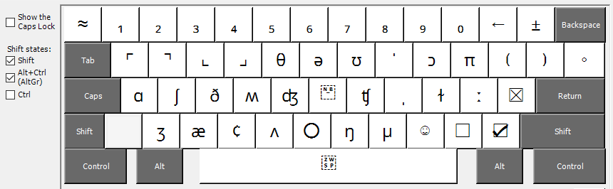

# Keyboard Layout (Writer+)

This is a standard US English QWERTY keyboard layout, with added common punctuation marks and common symbols.

The same layout as **Writer** but with additional ability to enter **English phonemes**

Required language pack: **English (United States)**

The extra symbols can be entered with **AltGr** (right Alt) and **AltGr+Shift**, see the screenshots and tables below.

## Screenshots

### Unshifted:

### Shifted:

### AltGr:

### AltGr+Shift:


## ASCII art

### AltGr (RightAlt or Alt+Ctrl):
```
┌───┬───┬───┬───┬───┬───┬───┬───┬───┬───┬───┬───┬───┬──────┐
│ ´ │ ¹ │ ² │ ³ │ ⁴ │ ⁵ │ ⁶ │ ⁷ │ ⁸ │ ⁹ │ ⁰ │ → │ ≠ │ bksp │
├───┴─┬─┴─┬─┴─┬─┴─┬─┴─┬─┴─┬─┴─┬─┴─┬─┴─┬─┴─┬─┴─┬─┴─┬─┴─┬────┤
│ tab │ … │ ⋯ │ é │ ® │ ™ │ √ │ ↑ │ ɪ │ ɒ │ ℗ │ ⟨ │ ⟩ │  • │
├─────┴─┬─┴─┬─┴─┬─┴─┬─┴─┬─┴─┬─┴─┬─┴─┬─┴─┬─┴─┬─┴─┬─┴─┬─┴────┤
│ caps  │ “ │ ” │ ↓ │ ° │ ɛ │ ‐ │ ɜ │ « │ » │ § │ × │  ent │
├───────┴─┬─┴─┬─┴─┬─┴─┬─┴─┬─┴─┬─┴─┬─┴─┬─┴─┬─┴─┬─┴─┬─┴──────┤
│ shift   │ ‘ │ ’ │ © │ ⁃ │ · │ – │ — │ ‹ │ › │ ÷ │  shift │
└─────────┴───┴───┴───┴───┴───┴───┴───┴───┴───┴───┴────────┘
```

### AltGr+Shift (RightAlt+Shift or Alt+Ctrl+Shift):
```
┌───┬───┬───┬───┬───┬───┬───┬───┬───┬───┬───┬───┬───┬──────┐
│ ≈ │ ₁ │ ₂ │ ₃ │ ₄ │ ₅ │ ₆ │ ₇ │ ₈ │ ₉ │ ₀ │ ← │ ± │ bksp │
├───┴─┬─┴─┬─┴─┬─┴─┬─┴─┬─┴─┬─┴─┬─┴─┬─┴─┬─┴─┬─┴─┬─┴─┬─┴─┬────┤
│ tab │ ⌜ │ ⌝ │ ⌞ │ ⌟ │ θ │ ə │ ʊ │ ˈ │ ɔ │ π │ ⟮ │ ⟯ │  ◦ │
├─────┴─┬─┴─┬─┴─┬─┴─┬─┴─┬─┴─┬─┴─┬─┴─┬─┴─┬─┴─┬─┴─┬─┴─┬─┴────┤
│ caps  │ ɑ │ ʃ │ ð │ ʍ │ ʤ │ ‑ │ ʧ │ ˌ │ ɫ │ ː │ ☒ │  ent │
├───────┴─┬─┴─┬─┴─┬─┴─┬─┴─┬─┴─┬─┴─┬─┴─┬─┴─┬─┴─┬─┴─┬─┴──────┤
│ shift   │ ʒ │ æ │ ¢ │ ʌ │ ○ │ ŋ │ µ │ ☺ │ ☐ │ ☑ │  shift │
└─────────┴───┴───┴───┴───┴───┴───┴───┴───┴───┴───┴────────┘
```

### Spaces

| Layer       | Unicode | Whitespace name |
|:------------|:--------|:----------------|
| Unshifted   | U+0020  | regular space |
| Shifted     | U+0020  | regular space |
| AltGr       | U+2003  | Em-space - width equal to font height |
| AltGr+Shift | U+200b  | zero-width space |

-----
Copyright (c) 2024 Neil Raiden, LLC (AGPL v3)